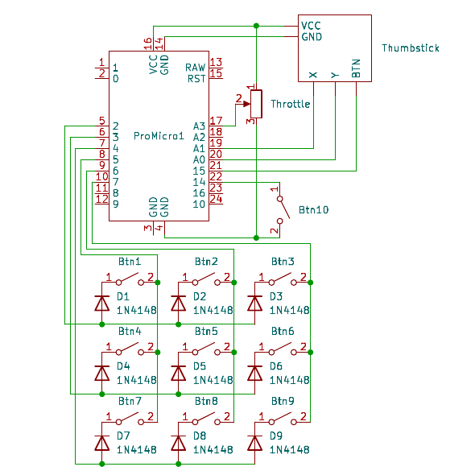

# LEGO Hands On Throttle And Stick (Stick WIP)

#### An Arduino Pro Micro based HOTAS setup built entirely with LEGO pieces

## Project Overview

The goal of this project is to create a fully functional HOTAS system using LEGO as the main building material. The Arduino Pro Micro is used to interface with the computer and translate the inputs from the controls into commands that can be recognized by games.

Keep in mind that I made this HOTAS as a personal project and this github repository is merely a way to share my design. The STUDio MOC i made is inside the assets/LEGO-Model folder.

## Micro-controller used

After hours of countless research I've decided to use the Arduino Pro Micro. The main reasons being cost and ease of programming. It has the Atmega32U4 as the main controller, which is one of the cheapest MCUs with native HID support. Therefore the computer can see it as a mouse, keyboard or joystick without needing extra hardware or complex programming. 

Since It's a kind of official Arduino model, it has all the benefits of the Arduino eco-system. Which means there are thousands of projects and documentation on the internet around DIY gamepads and similar setups. In this project I use two libraries from the Arduino eco-system, the [Joystick](https://github.com/MHeironimus/ArduinoJoystickLibrary) library and the [Keypad](https://github.com/Chris--A/Keypad) library.
 
## Features

- 11 Buttons (9 on the base and 2 on the handle);
- Dual axis thumbstick;
- The throttle itself;

I tried my best to emulate the shape and size of the F-18 and F-14 throttle handles. I also added a feature so that it hinges on the shaft so that I dont get my hand in a weird position when at full throttle.

## Fitting everything together

I used a combination of 22AWG wire (from old computer PSUs), some perfboard and Dupoint (Arduino-y type) connectors to connect all the electronics in the base, and some 9 conductor wire from an old computer case (specifically the audio cable from the front panel connectors).

I placed the throttle potentiometer right here with the pins pointing outwards, I passed the cable through the 2 x 1 brick with holes on the left side of the picture.

The thumbstick is double-sided taped to this plate on the right-hand side of the handle, roughly where my thumb sits.

Finding a place for the Arduino to sit was kinda difficult considering the amount of supports and internal pillars this thing has to make it durable. I endend up placing it here right above the main button matrix on the base.

I used 9 15mm normally open pushbuttons for the keypad on the base. They just sit on top of the base top cover and soldered them together from underneath. 

## Circuit Schematic

The schematic is fairly simple, I used common 1N4148 diodes to prevent ghosting and masking on the base buttons and have them connected like the schematic so that the "Conventional" button no.1 on a keypad is actually the first button on the gamepad configuration wizard on Windows.

## Also check:

* [r/HotasDIY](https://www.reddit.com/r/HotasDIY/) for the wonderful community and ideas.
* [u/the_arrgyle](https://www.reddit.com/user/the_arrgyle/) for the original inspiration for this project.